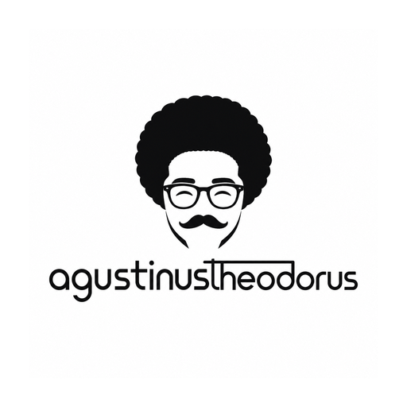

<p align="center">
  <a href="https://agustinustheodorus.com">
    
  </a>
</p>

<h1 align="center">agustinustheodorus.com</h1>

<p align="center">
  My personal website &mdash; portfolio, open-source work, and tech writing.
</p>

<p align="center">
  <a href="https://github.com/agustinustheo/agustinustheo.github.io/actions/workflows/pages/pages-build-deployment">
    
  </a>
  <a href="https://agustinustheodorus.com">
    
  </a>
  <a href="https://github.com/agustinustheo/agustinustheo.github.io/commits/master">
    
  </a>
  
  
  <a href="LICENSE">
    
  </a>
</p>

---

## About the site

This repository holds the source and the published build of my personal website,
[**agustinustheodorus.com**](https://agustinustheodorus.com). It's where I:

- Showcase my **portfolio** and current products ([BitSentry](https://bitsentry.ai/), [Mitratek Labs](http://mitrateklabs.com/)).
- Link out to my **open-source projects** and academic **publications**.
- Re-post my **tech articles** and long-form writing.

The site is a [Jekyll](https://jekyllrb.com/) site built on the
[Minimal Mistakes](https://mmistakes.github.io/minimal-mistakes/) theme and hosted on
GitHub Pages, served from the [`docs/`](docs/) folder.

## About me

Hi, I'm **Agustinus Theodorus** &mdash; a Rust engineer working on blockchain and
zero-knowledge cryptography. I'm a Core Runtime Engineer at
[Parity Technologies](https://www.parity.io/) and the founder of
[Mitratek Labs](http://mitrateklabs.com/), a B2B firm providing consulting and
contracting for blockchain companies worldwide. My work spans the Polkadot,
Solana, NEAR, and ICP ecosystems, covering runtime engineering, smart contracts,
and cryptographic research.

- 🌐 Website &mdash; [agustinustheodorus.com](https://agustinustheodorus.com)
- 💼 LinkedIn &mdash; [in/agustinus-theodorus](https://www.linkedin.com/in/agustinus-theodorus/)
- 🐙 GitHub &mdash; [@agustinustheo](https://github.com/agustinustheo)
- ✍️ Medium &mdash; [@agustinustheoo](https://agustinustheoo.medium.com)

## Project structure

```text
.
├── _config.yml          # Site configuration (title, author, nav, theme)
├── _data/               # Data files (authors, navigation)
├── _includes/           # Custom template overrides (masthead, head)
├── _pages/              # Standalone pages (e.g. Tech Articles)
├── _posts/              # Blog posts / tech articles (Markdown)
├── assets/img/          # Images, logos, favicons
├── about.markdown       # About page
├── index.html           # Home page (portfolio, open source, activity)
└── docs/                # Built site served by GitHub Pages
```

## Running locally

The site is a standard Jekyll project:

```bash
bundle install
bundle exec jekyll serve
```

Then open <http://localhost:4000>.

## License

Released into the public domain under the [Unlicense](LICENSE). The
[Minimal Mistakes](https://github.com/mmistakes/minimal-mistakes) theme is
distributed under its own MIT license.
